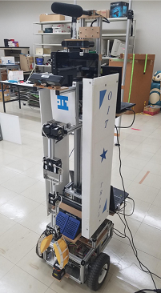

# ROS(1)

[README](./README.md)

---

## 準備

以下のコマンドで必要なソフトをインストールしておくこと。

```shell
$ sudo apt-get install -y ros-melodic-turtlesim
[sudo] password for [user name]: # パスワード入力 
Reading package lists... Done
Building dependency tree       
 ...
Unpacking ros-melodic-turtlesim (0.9.3-1bionic.20210505.020231) ...
Setting up ros-melodic-turtlesim (0.9.3-1bionic.20210505.020231) ...
```

## ROS とは

- Robot Operating System の略
  - [ROS のサイト](http://www.ros.org/)
- 複数の実行プログラムが協調する分散システムの構築をしやすくするミドルウェア
  - OS と皆さんが作成するアプリケーションの間に位置するソフト
- 実行プログラム間の通信を隠蔽してくれる仕組み、という理解でも可。

---

## 何故分散システムなのか

### ソフトウェアの面から

- ロボットの複雑なタスクを達成するにはたくさんの機能が必要。
  - 音声認識
  - 画像処理
  - アクチュエータ制御
  - 統合
- 全てを含んだ一つの実行プログラムを作成するとどうなるか
  - 一つの機能(関数)を変更した際にその影響が全体に及ぶ。
  - 一つの機能に問題があって、実行時エラーが発生した際に全ての機能が停止する。
  - 分担して開発しにくい。一つの機能だけをテストしにくい。

---

### ハードウェアの面から

- ロボットはたくさんのセンサを積んでいる。



- 実行プログラムを一つにまとめてしまうと、1 台の PC しか使えない。
  - 処理能力は足りる? USB ポートは足りる?
  - 「ハブで増設すれば?」というのは USB 通信帯域の問題でうまくいかない場合もある。

---

## ROS 用語

- ノード(`Node`)・・・一つの実行プログラム。
- トピック(`Topic`)・・・ノード間で送受信されるデータ。名前(トピック名)と型を持つ。
- パブリッシャ(`Publisher`)・・・トピックを発信するノード
- サブスクライバ(`Subscriber`)・・・トピックを受信(購読)するノード。
- ROS マスター・・・ノード同士を結び付けてくれるプログラム。
- ワークスペース・・・ノードを作成するための場所。通常はホームディレクトリに作成する。
- パッケージ・・・作成したノードをある程度のまとまりでグルーピングしたもの。

---

## 実習(1)

- ROS マスターの起動。ターミナルで下記コマンドを実行。

```shell
$ roscore
... logging to /home/[user name]/.ros/log/9474a7ce-4941-11ea-a3d0-000c2924787d/roslaunch-ubuntu-7288.log
Checking log directory for disk usage. This may take awhile.
Press Ctrl-C to interrupt
Done checking log file disk usage. Usage is <1GB.

started roslaunch server http://ubuntu:34303/
ros_comm version 1.14.3


SUMMARY
========

PARAMETERS
 * /rosdistro: melodic
 * /rosversion: 1.14.3

NODES

auto-starting new master
process[master]: started with pid [7299]
ROS_MASTER_URI=http://ubuntu:11311/

setting /run_id to 9474a7ce-4941-11ea-a3d0-000c2924787d
process[rosout-1]: started with pid [7310]
started core service [/rosout]
```

- 出力されたメッセージを確認すること。
  - `melodic`という文字が出ているはず。

### Melodic Morenia

- ROS の LTS (Long Term Support) バージョンの一つ。
- 確認できたら、`Ctrl+C`で終了させておく。

---

## ワークスペースの確認

**まず、自分の環境にワークスペースがあるかどうかを確認すること。**

```shell
$ cd
$ ls|grep catkin
catkin_ws # この表示があれば、ワークスペースは存在している。
```

ワークスペースが **「ないときだけ」** 以下「ワークスペースの作成」を実行する。

### ワークスペースの作成

```shell
$ mkdir -p ~/catkin_ws/src
$ cd ~/catkin_ws/src
$ catkin_init_workspace
Creating symlink "/home/[user name]/catkin_ws/src/CMakeLists.txt" pointing to "/opt/ros/melodic/share/catkin/cmake/toplevel.cmake"
$ cd ~/catkin_ws/
$ catkin_make
Base path: /home/[user name]/catkin_ws
Source space: /home/[user name]/catkin_ws/src
Build space: /home/[user name]/catkin_ws/build
Devel space: /home/[user name]/catkin_ws/devel
Install space: /home/[user name]/catkin_ws/install
####
#### Running command: "cmake /home/[user name]/catkin_ws/src -DCATKIN_DEVEL_PREFIX=/home/[user name]/catkin_ws/devel -DCMAKE_INSTALL_PREFIX=/home/[user name]/catkin_ws/install -G Unix Makefiles" in "/home/[user name]/catkin_ws/build"
####
-- The C compiler identification is GNU 7.4.0
...
-- Build files have been written to: /home/[user name]/catkin_ws/build
####
#### Running command: "make -j2 -l2" in "/home/[user name]/catkin_ws/build"
####
```

- 任意のエディタで`~/.bashrc`を開き、ファイル最下段に下記を追記。

```text
source ~/catkin_ws/devel/setup.bash
```

- `.bashrc`：シェル(ターミナル)起動時に実行されるスクリプト
- `source`：スクリプトを実行するコマンド
- この修正により、ターミナル起動時に`~/catkin_ws/devel/setup.bash`が実行され、`ROS`の実行に必要な環境変数がセットされる。
- 作業中のターミナルを閉じる。
- ここまでの作業はワークスペース作成時に一度だけ必要。

---

## catkin_create_pkg コマンドによるパッケージの作成

- 第一引数：作成するパッケージの名前（例：`beginner_tutorials`）
- 第二引数以降：使用する機能（例：`std_msgs rospy roscpp`）を指定。

```shell
$ cd ~/catkin_ws/src
$ catkin_create_pkg beginner_tutorials std_msgs rospy roscpp
Created file beginner_tutorials/CMakeLists.txt
Created file beginner_tutorials/package.xml
Created folder beginner_tutorials/include/beginner_tutorials
Created folder beginner_tutorials/src
Successfully created files in /home/[user name]/catkin_ws/src/beginner_tutorials. Please adjust the values in package.xml.
$ cd ~/catkin_ws
$ catkin_make
```

- ここでターミナルを閉じる
  - 必須の操作ではない。演習の都合上の操作。

---

## 簡単なパブリッシャとサブスクライバの作成(1)

- 参考：[ROS/Tutorials/WritingPublisherSubscriber(python)](http://wiki.ros.org/ROS/Tutorials/WritingPublisherSubscriber%28python%29)
- ターミナルを開き、次のコマンドを実行

```shell
$ roscd beginner_tutorials
```

### 問題(1)

- カレントディレクトリを確認しなさい。

---

## roscd [パッケージ名]

- `ROS`パッケージのディレクトリに移動できる。
- `.bashrc`に`source`コマンドを追記したので、自作パッケージのディレクトリを簡単に取得できるようになっている。
- 下記のコマンドでその他のパッケージを見に行こう。

```shell
$ roscd turtlesim
$ pwd
/opt/ros/melodic/share/turtlesim
$ roscd rviz
$ pwd
/opt/ros/melodic/share/rviz
$ roscd beginner_tutorials
```

---

## 簡単なパブリッシャとサブスクライバの作成(2)

- [Python](./basics_01_py.md)
- [C++](./basics_01_cpp.md)

---

## 応用問題(1)

- ROS の`std_msg`について調べなさい。
  - `String`以外にどのような型が用意されているか、[std_msgs](http://wiki.ros.org/std_msgs)を参考に調べなさい。

---

## 発展課題(1)

- 2 人組になり[複数の PC で ROS の通信を行う設定](./basics_02.md)を行い、双方で`talker.py`と`listener.py`を動かし通信しなさい。
- `talker.py`が出力するデータを好きな文字に変えて再び実行し、通信相手にメッセージを届けなさい。
- マスタとスレーブの役割を交代しながら実施すること。

---

[README](./README.md)
