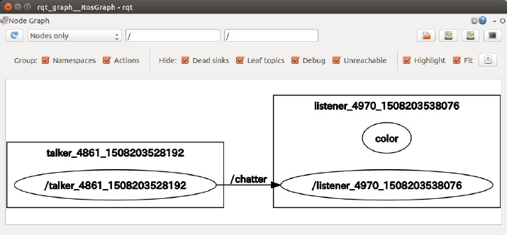

# ROS(1) 様々な ROS のコマンド

[ROS(1) Python](./basics_01_py.md)  
[ROS(1) C++](./basics_01_cpp.md)  
[ROS(1)](./basics_01.md)  

---

- 以下の図やコマンド実行結果は`Python`と`C++`版で若干異なります。

## rqt_graph

- ROS のノード同士のつながりを可視化する。

```shell
$ rqt_graph
```



## rostopic list

- 現在流れているトピックのリストを得る。

```shell
$ rostopic list
/chatter
/rosout
/rosout_agg
```

---

## rostopic echo [トピック名]

- [トピック名]のデータを表示する。
- 例:`rostopic echo /chatter`
  - トピック名は`tab`キー補完可能

```shell
$ rostopic echo /chatter
data: "hello world 1581037256.15"
---
data: "hello world 1581037256.25"
---
data: "hello world 1581037256.35"
...
```

## rostopic type [トピック名]

- [トピック名]の型を表示する。
- 例:`rostopic type /chatter`

```shell
$ rostopic type /chatter
std_msgs/String
```

---

[ROS(1) Python](./basics_01_py.md)  
[ROS(1) C++](./basics_01_cpp.md)  
[ROS(1)](./basics_01.md)  
