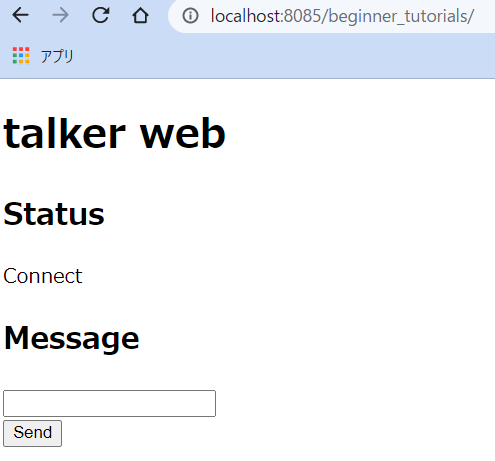

# ROS(1) C++

[ROS(1)](./basics_01.md)

---

## 簡単なパブリッシャとサブスクライバの作成(2)

```shell
$ roscd beginner_tutorials/src
$ pwd
/home/[user name]/catkin_ws/src/beginner_tutorials/src
```

- `src`ディレクトリに下記二つのファイルをダウンロードする。リンククリックでも良いが、ダウンロード用コマンド`wget`の実行例をリンクの後に記載しているので、それを使っても良い。
  - [talker.cpp](https://raw.githubusercontent.com/ros/ros_tutorials/kinetic-devel/roscpp_tutorials/talker/talker.cpp)
  - [listener.py](https://raw.githubusercontent.com/ros/ros_tutorials/kinetic-devel/roscpp_tutorials/listener/listener.cpp)

```shell
$ wget https://raw.githubusercontent.com/ros/ros_tutorials/kinetic-devel/roscpp_tutorials/talker/talker.cpp -O talker.cpp

--2021-09-22 14:37:25--  https://raw.githubusercontent.com/ros/ros_tutorials/kinetic-devel/roscpp_tutorials/talker/talker.cpp
Resolving raw.githubusercontent.com (raw.githubusercontent.com)... 185.199.109.133, 185.199.108.133, 185.199.110.133, ...
Connecting to raw.githubusercontent.com (raw.githubusercontent.com)|185.199.109.133|:443... connected.
HTTP request sent, awaiting response... 200 OK
Length: 5044 (4.9K) [text/plain]
Saving to: ‘talker.cpp’

talker.cpp                            100%[========================================================================>]   4.93K  --.-KB/s    in 0.001s  

2021-09-22 14:37:25 (7.17 MB/s) - ‘talker.cpp’ saved [5044/5044]
```

```shell
$ wget https://raw.githubusercontent.com/ros/ros_tutorials/kinetic-devel/roscpp_tutorials/listener/listener.cpp -O listener.cpp
--2021-09-22 14:45:50--  https://raw.githubusercontent.com/ros/ros_tutorials/kinetic-devel/roscpp_tutorials/listener/listener.cpp
Resolving raw.githubusercontent.com (raw.githubusercontent.com)... 185.199.109.133, 185.199.110.133, 185.199.108.133, ...
Connecting to raw.githubusercontent.com (raw.githubusercontent.com)|185.199.109.133|:443... connected.
HTTP request sent, awaiting response... 200 OK
Length: 4070 (4.0K) [text/plain]
Saving to: ‘listener.cpp’

listener.cpp                              100%[=====================================================================================>]   3.97K  --.-KB/s    in 0s      

2021-09-22 14:45:50 (14.3 MB/s) - ‘listener.cpp’ saved [4070/4070]
```

テキストエディタで`~catkin_ws/src/beginner_tutorials/CMakeLists.txt`を編集し、末尾に以下を貼り付ける。

```text
add_executable(talker src/talker.cpp)
target_link_libraries(talker ${catkin_LIBRARIES})

add_executable(listener src/listener.cpp)
target_link_libraries(listener ${catkin_LIBRARIES})
```

## コンパイル

以下のコマンドでコンパイルする。`C++`の場合は、ファイルを編集後、実行前に必ずコンパイルが必要である。

```shell
$ cd ~/catkin_ws && catkin_make
Base path: /home/[user name]/catkin_ws
Source space: /home/[user name]/catkin_ws/src
...
####
#### Running command: "make cmake_check_build_system" in "/home/[user name]/catkin_ws/build"
...
[ 98%] Linking CXX executable /home/ubuntu/catkin_ws/devel/lib/beginner_tutorials/talker
[100%] Linking CXX executable /home/ubuntu/catkin_ws/devel/lib/beginner_tutorials/listener
[100%] Built target talker
[100%] Built target listener # 100% まで表示されたら成功
```

## talker と listener の実行

```shell
$ rosrun beginner_tutorials talker
```

- エラーが出て何も起きないはず。
  - どんなメッセージか確認する。
  - `Ctrl+C`でプログラムを終了させる。
- エラーが出ずに無事実行できた人は手順を飛ばしているか、勘の良い人。

`rosrun [パッケージ名][ノード名]`

- あるパッケージに含まれるノードを実行する。
  - ただし、ノードの実行には原則事前に ROS マスターを起動しておくことが必要。
- 別のターミナルを開き`roscore`を実行する。
- さらに別のターミナルを開き次のコマンドを実行。

```shell
$ rosrun beginner_tutorials talker
[INFO] [1581037099.621621]: hello world 0
[INFO] [1581037099.722943]: hello world 1
[INFO] [1581037099.822706]: hello world 2
...
```

- さらに別のターミナルを開き次のコマンドを実行。

```shell
$ rosrun beginner_tutorials listener
[INFO] [1581037131.453663]: I heard hello: [hello world 45]
[INFO] [1581037131.555024]: I heard hello: [hello world 46]
[INFO] [1581037131.658074]: I heard hello: [hello world 47]
...
```

---

## 様々な ROS のコマンド

２つのノードを実行したままで、[様々な ROS のコマンド](./basics_01_commands.md)を試してみましょう。

---

## talker.cpp のポイント

- エディタ等で`talker.cpp`を見てみる。

```c++
#include "ros/ros.h"
#include "std_msgs/String.h"
#include <sstream>

int main(int argc, char **argv)
{
  // 'talker'という名前でノードを生成する。
  ros::init(argc, argv, "talker");
  ros::NodeHandle n;
  // 'chatter'というトピック名にデータをパブリッシュする準備。
  ros::Publisher chatter_pub = n.advertise<std_msgs::String>("chatter", 1000);
  ros::Rate loop_rate(10); // 10hzでループを回す。
  int count = 0;
  while (ros::ok())
  {
    std_msgs::String msg;

    std::stringstream ss;
    ss << "hello world " << count;
    msg.data = ss.str();
    ROS_INFO("%s", msg.data.c_str()); // 端末上に ss の内容を表示。
    chatter_pub.publish(msg); // ss の内容をパブリッシュ。
    ros::spinOnce();
    loop_rate.sleep();
    ++count;
  }
  return 0;
}
```

---

## listener.cpp のポイント

- エディタ等で`listener.cpp`を見てみる。

```c++
#include "ros/ros.h"
#include "std_msgs/String.h"

void chatterCallback(const std_msgs::String::ConstPtr& msg)
{
  // 受信したデータを表示。
  ROS_INFO("I heard: [%s]", msg->data.c_str());
}

int main(int argc, char **argv)
{
  // 'listener'という名前でノードを生成する。
  ros::init(argc, argv, "listener");
  ros::NodeHandle n;
  // 'chatter'というトピック名のデータを受信する準備。
  // 受信した瞬間に chatterCallback という関数が呼ばれるようにしている。
  ros::Subscriber sub = n.subscribe("chatter", 1000, chatterCallback);
  ros::spin();
  return 0;
}
```

## 問題(3)

- ROS マスター、`talker`、`listener` を全て`Ctrl+C`で終了させなさい。

---

## WEB ブラウザからデータを送信する

`ROS`は基本的には`Publisher/Subscriber`という手続きに沿って動くノード同士の通信しかサポートしていない。  
しかし、[rosbridge_server](http://wiki.ros.org/rosbridge_server)というシステムを使うことで、`TCP/IP`、`UDP`、`WebSocket`という他の通信方式を使い、`ROS`を使っていないプログラムとも通信することができる。

ここでは[rosbridge_server](http://wiki.ros.org/rosbridge_server)に加え、[roswww](http://wiki.ros.org/roswww)という WEB サーバを起動する`ROS`ノードを使い、 WEB ブラウザと`ROS`ノード間の通信について実験する。

1. 以下のディレクトリを作成しなさい。

```shell
$ roscd beginner_tutorials
$ pwd
/home/[user name]/catkin_ws/src/beginner_tutorials
$ mkdir launch www
```

2. [web_cpp.launch](./basics_01/web_cpp.launch)を`~/catkin_ws/src/beginner_tutorials/launch`にダウンロードしなさい。

```shell
$ roscd beginner_tutorials/launch
$ wget https://raw.githubusercontent.com/KMiyawaki/lecture_ros/main/basics_01/web_cpp.launch -O web_cpp.launch
```

3. [index.html](./basics_01/index.html)を`~/catkin_ws/src/beginner_tutorials/www`にダウンロードしなさい。

```shell
$ roscd beginner_tutorials/www
$ wget https://raw.githubusercontent.com/KMiyawaki/lecture_ros/main/basics_01/index.html -O index.html
```

4. ターミナルで起動している全てのソフトを終了してから下記コマンドを実行しなさい。

```shell
$ roslaunch beginner_tutorials web_cpp.launch
... logging to /home/[user name]/.ros/log/38823204-1f3e-11ec-a97a-80fa5b7fbe40/roslaunch-MyComputer-13226.log
Checking log directory for disk usage. This may take a while.

SUMMARY
========
...省略...
2021-09-27 11:54:28+0900 [-] WebSocketServerFactory starting on 9090
2021-09-27 11:54:28+0900 [-] Starting factory <autobahn.twisted.websocket.WebSocketServerFactory object at 0x7f73633f87d0>
2021-09-27 11:54:28+0900 [-] [INFO] [1632711268.107163]: Rosbridge WebSocket server started at ws://0.0.0.0:9090
```

5. WEBブラウザで[http://localhost:8085/beginner_tutorials/](http://localhost:8085/beginner_tutorials/)にアクセスしなさい。以下のような画面が見えるはずである。



6. ブラウザ上のテキストボックスに適当な文字を入れ、ボタンを押すと、`web_cpp.launch`を実行した端末上にブラウザから送信した文字が表示される。

7. 実験が終わったら、全てのターミナルのソフトとWEBブラウザの[http://localhost:8085/beginner_tutorials/](http://localhost:8085/beginner_tutorials/)を表示しているタブを閉じなさい。

## 問題(4)

- `talker.cpp`を次のように変更しなさい。

### 修正(4-1)

```C++
#include "std_msgs/String.h"
#include "std_msgs/Int32.h" // 追記
```

### 修正(4-2)

```C++
ros::Publisher chatter_pub = n.advertise<std_msgs::String>("chatter", 1000);
ros::Publisher number_pub = n.advertise<std_msgs::Int32>("number", 1000); // 追記
```

---

### 修正(4-3)

```c++
chatter_pub.publish(msg);
std_msgs::Int32 num; // 追記
num.data = count % 40; // 追記
number_pub.publish(num); // 追記
```

- コンパイルしてから`talker`を実行しなさい。
- `rostpic list`を使って、どのようなトピックが流れるようになったかを確認しなさい。
- `rostopic echo`で実際にデータの内容を確認しなさい。

---

## 問題(5)

- `listener.cpp`を次のように編集し、コンパイルしてから実行結果を確認しなさい。

### 修正(5-1)

```C++
#include "std_msgs/String.h"
#include "std_msgs/Int32.h" // 追記
```

### 修正(5-2)

```C++
ros::Subscriber sub = n.subscribe("chatter", 1000, chatterCallback);
ros::Subscriber number_sub = n.subscribe("number", 1000, numberCallback); // 追記
```

### 修正(5-3)

```c++
void chatterCallback(const std_msgs::String::ConstPtr& msg)
{
  ROS_INFO("I heard: [%s]", msg->data.c_str());
}

void numberCallback(const std_msgs::Int32::ConstPtr& msg)
{
  ROS_INFO("number: [%d]", msg->data);
}
```

## 問題(6)

`listener.cpp`の`numberCallback`を受信したデータに応じて以下のような出力をするように変更してください。

- `msg->data`が3で割り切れるときは`Fizz`
- `msg->data`が5で割り切れるときは`Buzz`
- `msg->data`が3でも5で割り切れるときは`Fizz Buzz`
- `msg->data`が3でも5で割り切れないときは`msg->data`をそのまま出力する。

---

[ROS(1)](./basics_01.md)
