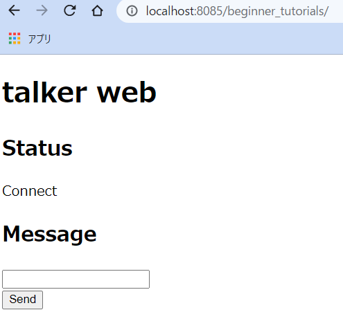

# ROS(1) Python

[ROS(1)](./basics_01.md)

---

## 簡単なパブリッシャとサブスクライバの作成(2)

```shell
$ roscd beginner_tutorials
$ mkdir scripts
$ cd scripts
$ pwd
/home/[user name]/catkin_ws/src/beginner_tutorials/scripts
```

- `scripts`ディレクトリに下記二つのファイルをダウンロードする。リンククリックでも良いが、ダウンロード用コマンド`wget`の実行例をリンクの後に記載しているので、それを使っても良い。
  - [talker.py](https://raw.github.com/ros/ros_tutorials/kinetic-devel/rospy_tutorials/001_talker_listener/talker.py)
  - [listener.py](https://raw.github.com/ros/ros_tutorials/kinetic-devel/rospy_tutorials/001_talker_listener/listener.py)

```shell
$ wget https://raw.githubusercontent.com/ros/ros_tutorials/kinetic-devel/rospy_tutorials/001_talker_listener/talker.py -O talker.py
--2020-10-07 15:38:36--  https://raw.githubusercontent.com/ros/ros_tutorials/kinetic-devel/rospy_tutorials/001_talker_listener/talker.py
Resolving raw.githubusercontent.com (raw.githubusercontent.com)... 151.101.228.133
・・・
talker.py                                 100%[==================================================================================>]   2.17K  --.-KB/s    in 0s      

2020-10-07 15:38:37 (10.1 MB/s) - ‘talker.py’ saved [2217/2217]
```

```shell
$ wget https://raw.github.com/ros/ros_tutorials/kinetic-devel/rospy_tutorials/001_talker_listener/listener.py -O listener.py
--2020-10-07 15:40:18--  https://raw.github.com/ros/ros_tutorials/kinetic-devel/rospy_tutorials/001_talker_listener/listener.py
Resolving raw.github.com (raw.github.com)... 151.101.228.133
・・・
listener.py                               100%[==================================================================================>]   2.35K  --.-KB/s    in 0s      

2020-10-07 15:40:19 (7.51 MB/s) - ‘listener.py’ saved [2406/2406]
```

- VSCode でダウンロードした二つのファイルの上から２行目に`# -*- coding: utf-8 -*-`と追記し、日本語が使えるようにしておく。

```python
#!/usr/bin/env python
# -*- coding: utf-8 -*-
# Software License Agreement (BSD License)
```

### 問題(2)

- ダウンロードした 2 つのファイルにユーザの実行権限をつけなさい。

---

```shell
$ chmod u+x talker.py
$ chmod u+x listener.py
```

- 権限が付与されたことを`ls -l`で確認すること。

```shell
$ ls -l
合計 8
-rwxrw-r-- 1 oit oit 2406  2月 12 12:43 listener.py
-rwxrw-r-- 1 oit oit 2217  2月 12 12:43 talker.py
```

先頭の`-rwxr`で、`x`が実行権限があることを示している。

---

## talker.py と listener.py の実行

```shell
$ cd ~/catkin_ws
$ catkin_make
$ rosrun beginner_tutorials talker.py
```

- エラーが出て何も起きないはず。
  - どんなメッセージか確認する。
  - `Ctrl+C`でプログラムを終了させる。
- エラーが出ずに無事実行できた人は手順を飛ばしているか、勘の良い人。

---

`rosrun [パッケージ名][ノード名]`

- あるパッケージに含まれるノードを実行する。
  - ただし、ノードの実行には原則事前に ROS マスターを起動しておくことが必要。
- 別のターミナルを開き`roscore`を実行する。
- さらに別のターミナルを開き次のコマンドを実行。

```shell
$ rosrun beginner_tutorials talker.py
[INFO] [1581037099.621621]: hello world 1581037099.62
[INFO] [1581037099.722943]: hello world 1581037099.72
[INFO] [1581037099.822706]: hello world 1581037099.82
...
```

- さらに別のターミナルを開き次のコマンドを実行。

```shell
$ rosrun beginner_tutorials listener.py
[INFO] [1581037131.453663]: /listener_8862_1581037131191I heard hello world 1581037131.45
[INFO] [1581037131.555024]: /listener_8862_1581037131191I heard hello world 1581037131.55
[INFO] [1581037131.658074]: /listener_8862_1581037131191I heard hello world 1581037131.65
...
```

---

## 様々な ROS のコマンド

２つのノードを実行したままで、[様々な ROS のコマンド](./basics_01_commands.md)を試してみましょう。

## talker.py のポイント

- エディタ等で`talker.py`を見てみる。

```python
def talker():
    # 'chatter'というトピック名にデータをパブリッシュする準備。
    pub = rospy.Publisher('chatter', String, queue_size=10)
    # 'talker'という名前でノードを生成する。
    # anonymous=True により、名前にランダムな番号が追加される。
    rospy.init_node('talker', anonymous=True)
    rate = rospy.Rate(10) # 10hzでループを回す。
    while not rospy.is_shutdown():
        hello_str = "hello world %s" % rospy.get_time()
        rospy.loginfo(hello_str) # 端末上に hello_str の内容を表示。
        pub.publish(hello_str) # hello_str をパブリッシュ。
        rate.sleep()
```

### 補足

以下のプログラムは見慣れない文かもしれない。

```python
        hello_str = "hello world %s" % rospy.get_time()
```

これは[文字列フォーマット操作](https://docs.python.org/ja/2.7/library/stdtypes.html#string-formatting)と呼ばれる書き方で、数値等を`printf`と同じ感覚で文字列に埋め込むことができるものである。

- [利用例](https://python.civic-apps.com/string-format/)

---

## listener.py のポイント

- エディタ等で`listener.py`を見てみる。

```python
def callback(data):
    # 受信したデータを表示。
    rospy.loginfo(rospy.get_caller_id() + 'I heard %s', data.data)

def listener():
    # 'listener'という名前でノードを生成する。
    rospy.init_node('listener', anonymous=True)
    # 'chatter'というトピック名のデータを受信する準備。
    # 受信した瞬間に callback という関数が呼ばれるようにしている。
    rospy.Subscriber('chatter', String, callback)
    # 無限ループ開始
    rospy.spin()

if __name__ == '__main__':
    listener()
```

## 問題(3)

- ROS マスター、`talker.py`、`listener.py` を全て`Ctrl+C`で終了させなさい。

## WEB ブラウザからデータを送信する

`ROS`は基本的には`Publisher/Subscriber`という手続きに沿って動くノード同士の通信しかサポートしていない。  
しかし、[rosbridge_server](http://wiki.ros.org/rosbridge_server)というシステムを使うことで、`TCP/IP`、`UDP`、`WebSocket`という他の通信方式を使い、`ROS`を使っていないプログラムとも通信することができる。

ここでは[rosbridge_server](http://wiki.ros.org/rosbridge_server)に加え、[roswww](http://wiki.ros.org/roswww)という WEB サーバを起動する`ROS`ノードを使い、 WEB ブラウザと`ROS`ノード間の通信について実験する。

1. 以下のディレクトリを作成しなさい。

```shell
$ roscd beginner_tutorials
$ pwd
/home/[user name]/catkin_ws/src/beginner_tutorials
$ mkdir launch www
```

2. [web_py.launch](./basics_01/web_py.launch)を`~/catkin_ws/src/beginner_tutorials/launch`にダウンロードしなさい。

```shell
$ roscd beginner_tutorials/launch
$ wget https://raw.githubusercontent.com/KMiyawaki/lecture_ros/main/basics_01/web_py.launch -O web_py.launch
```

3. [index.html](./basics_01/index.html)を`~/catkin_ws/src/beginner_tutorials/www`にダウンロードしなさい。

```shell
$ roscd beginner_tutorials/www
$ wget https://raw.githubusercontent.com/KMiyawaki/lecture_ros/main/basics_01/index.html -O index.html
```

4. ターミナルで起動している全てのソフトを終了してから下記コマンドを実行しなさい。

```shell
$ roslaunch beginner_tutorials web_py.launch
... logging to /home/[user name]/.ros/log/38823204-1f3e-11ec-a97a-80fa5b7fbe40/roslaunch-MyComputer-13226.log
Checking log directory for disk usage. This may take a while.

SUMMARY
========
...省略...
2021-09-27 11:54:28+0900 [-] WebSocketServerFactory starting on 9090
2021-09-27 11:54:28+0900 [-] Starting factory <autobahn.twisted.websocket.WebSocketServerFactory object at 0x7f73633f87d0>
2021-09-27 11:54:28+0900 [-] [INFO] [1632711268.107163]: Rosbridge WebSocket server started at ws://0.0.0.0:9090
```

5. WEBブラウザで[http://localhost:8085/beginner_tutorials/](http://localhost:8085/beginner_tutorials/)にアクセスしなさい。以下のような画面が見えるはずである。



6. ブラウザ上のテキストボックスに適当な文字を入れ、ボタンを押すと、`web_py.launch`を実行した端末上にブラウザから送信した文字が表示される。

7. 実験が終わったら、全てのターミナルのソフトとWEBブラウザの[http://localhost:8085/beginner_tutorials/](http://localhost:8085/beginner_tutorials/)を表示しているタブを閉じなさい。

---

## 問題(4)

- `talker.py`を次のように変更しなさい。

### 修正(4-1)

```python
from std_msgs.msg import String
from std_msgs.msg import Int32 # 追記
```

### 修正(4-2)

```python
pub = rospy.Publisher('chatter', String, queue_size=10)
pubInt32 = rospy.Publisher('number', Int32, queue_size=10) # 追記
number = 0 # 追記
```

---

### 修正(4-3)

```python
pub.publish(hello_str)
pubInt32.publish(number) # 追記
number = (number + 1) % 40 # 追記
```

- `talker.py`を実行しなさい。
- `rostpic list`を使って、どのようなトピックが流れるようになったかを確認しなさい。
- `rostopic echo`で実際にデータの内容を確認しなさい。

---

## 問題(5)

- `listener.py`を次のように編集し、実行結果を確認しなさい。

### 修正(5-1)

```python
from std_msgs.msg import String
from std_msgs.msg import Int32 #追記
```

### 修正(5-2)

```python
rospy.Subscriber('chatter', String, callback)
rospy.Subscriber('number', Int32, callbackInt32) # 追記
```

### 修正(5-3)

```python
def callback(data):
    rospy.loginfo(rospy.get_caller_id() + 'I heard %s', data.data)

def callbackInt32(data): # 追記
    rospy.loginfo(rospy.get_caller_id() + 'I heard %d', data.data) # 追記
```

## 問題(6)

`listener.py`の`callbackInt32(data)`を受信したデータに応じて以下のような出力をするように変更してください。

- `data.data`が3で割り切れるときは`Fizz`
- `data.data`が5で割り切れるときは`Buzz`
- `data.data`が3でも5で割り切れるときは`Fizz Buzz`
- `data.data`が3でも5で割り切れないときは`data.data`をそのまま出力する。

---

[ROS(1)](./basics_01.md)
