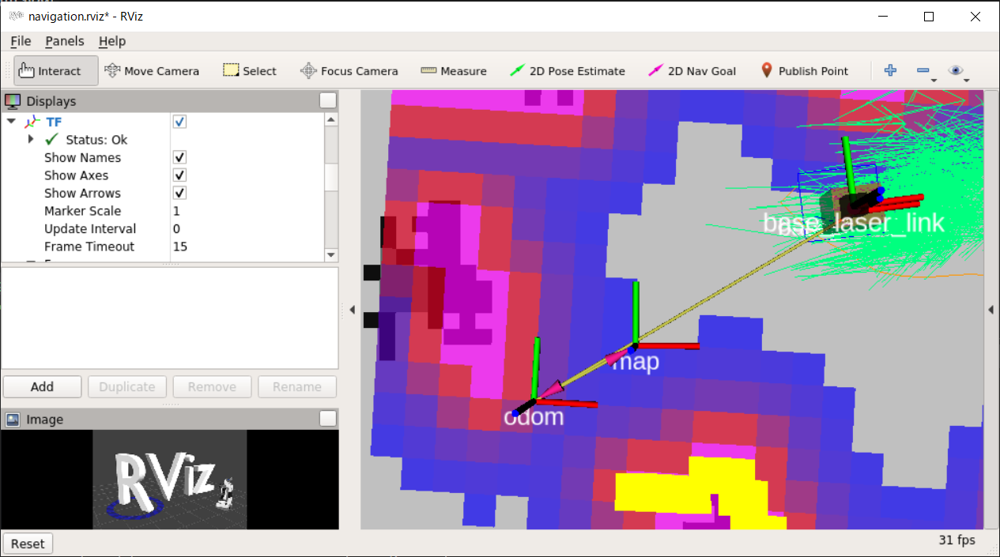

# move_base にコマンドを送る (C++)

[ROS navigation の Action Server を使う](./Home.md)

---

## サンプルの実行

- プログラムを格納するディレクトリがなければ作る。

```shell
$ roscd beginner_tutorials
$ ls|grep src
src # このディレクトリがあれば良い。
$ cd src
```

- `src`に下記ファイルをダウンロードする。リンククリック->右クリック保存もしくは、リンクの下方に記述してある`wget`コマンドで取得する。
  - [simple_navigation.cpp](https://raw.githubusercontent.com/KMiyawaki/lecture_ros/main/stage_simulator/navigation_action_server/simple_navigation_goals.cpp)

```shell
$ wget https://raw.githubusercontent.com/KMiyawaki/lecture_ros/main/stage_simulator/navigation_action_server/simple_navigation_goals.cpp -O simple_navigation_goals.cpp
・・・
simple_navigation_goals.cpp                        100%[===============================================================================================================================>]   1.16K  --.-KB/s    in 0s      

2020-10-13 07:47:48 (27.9 MB/s) - ‘simple_navigation_goals.cpp’ saved [1191/1191]
```

### `CMakeLists.txt`の編集とコンパイル

```shell
$ roscd beginner_tutorials
$ ls|grep CMakeLists
CMakeLists.txt # このファイルをエディタで編集する。
```

編集箇所は以下の通り。

```text
find_package(catkin REQUIRED COMPONENTS
  roscpp
  rospy
  std_msgs
  actionlib # 追記
)
... 省略 ...
# 末尾に追記
add_executable(simple_navigation_goals src/simple_navigation_goals.cpp)
target_link_libraries(simple_navigation_goals ${catkin_LIBRARIES})
```

編集後、コンパイルする。

```shell
$ cd ~/catkin_ws && catkin_make
# エラー無く100%まで進めばOK。
```

### プログラムの実行

- シミュレータを起動しておいてから実行する。

```shell
$ rosrun beginner_tutorials simple_navigation_goals
[ INFO] [1632444471.020929000, 431.625000000]: Sending goal
[ INFO] [1632444476.143639000, 436.750000000]: SUCCEEDED
```

- ロボットが少し前進し停止するはず。
- プログラムを編集する。編集箇所は次の通り。

```c++
goal.target_pose.header.frame_id = "base_link"; // ロボットローカル座標系
を
goal.target_pose.header.frame_id = "map"; // マップ座標系
にして、以下を追記編集する。
goal.target_pose.pose.position.x = 7.0; // x 座標変更
goal.target_pose.pose.position.y = 3.0; // y 座標追記
```

編集後、再度コンパイルして実行する。

## 課題

- 以下の課題は`simple_navigation_goals.cpp`に順番に実装して行けば良い。

### 課題（１）

- 任意の目標地点にロボットを自律移動させる関数`goto_point`を作成し、`main`関数で使用しなさい。返却値はなし。仮引数は`actionlib::SimpleActionClient<move_base_msgs::MoveBaseAction>`への参照`ac`、目標地点の座標`x, y`（実数）。
  - 関数プロトタイプ宣言は具体的には`void goto_point(MoveBaseClient&ac, double x, double y)`である。`MoveBaseClient`が`typedef`されていることに注意すること。
  - 関数化するのは`simple_navigation_goals.cpp`でいうと、下記の範囲である。
    - [20行目](https://github.com/KMiyawaki/lecture_ros/blob/main/stage_simulator/navigation_action_server/simple_navigation_goals.cpp#L20)～[48行目](https://github.com/KMiyawaki/lecture_ros/blob/main/stage_simulator/navigation_action_server/simple_navigation_goals.cpp#L48)

#### C++ の参照について

ある構造体やクラスの変数を関数の引数に与えることを考える。

```c++
typedef struct tagTest{
  int value1, value2, value3;
  char data[1024];
}Test;

void func1(Test t);
void func2(Test* pT);   // ポインタを仮引数にする。
void func3(Test& refT); // 参照を仮引数にする。
```

`func1, func2, func3`の違いは何だろうか。

- `func1`は実行時に`Test`型の変数が仮引数`t`に全てコピーされる。
- `func2`は実行時に`Test`型の変数のアドレスだけが仮引数`pT`にコピーされる。`func2`内部では`pT->value1`のようにアロー演算子でメンバにアクセスする。

この二つを比較すると`func2`がコピーするデータ量で優位に立つことが明らかである。また、ポインタ、つまり変数のアドレスを引数に与えるので、`func2`内で`pT`を使ってメンバに変更を加えると、`func2`呼び出し側が`func2`に実引数として与えた`Test`型変数のメンバも変更される。

`func3`も`func2`と同じで、変数のデータコピーは発生せず、`func3`呼び出し側で定義されている実引数の中身を操作することが可能であるが、文法的に以下の違いがある。

- `func3`は実行時に`Test`型の変数の参照が仮引数`refT`にコピーされる。`func3`内部では`refT.value1`のように通常のメンバ参照演算子でメンバにアクセスする。

どのようなときに、参照やポインタを引数にするかはケースバイケースである。  
関数内部でデータの複製をつくり、関数呼び出し側で定義された実引数に影響を与えたくない場合もある。

`Java`や`Python`ではクラス型や配列型を関数の引数とした場合、自動的に参照が渡される。

### 課題（２）

- `goto_point`関数に仮引数`theta`（実数で単位はラジアン）を追加し、目的地についたとき`theta`で指定した方向をロボットが向くようにしなさい。改良した関数を使用し、シミュレータで結果を確認しなさい。
  - ここで「ロボットの方向」とは`map`座標系での角度を意味しており、マイナス180度～プラス180度で表す。
  - RViz で 3D ビューをズームしたとき、`map`と書かれた座標軸が見える。その X 軸方向がゼロ度で、反時計回りがプラスである。



- 360度表記からラジアンに変換するには`#include <angles/angles.h>`を加えて、`angles::from_degrees`を使う。`angles::from_degrees`は`main`関数から`goto_point`の呼び出し時に使う。
- 角度`theta`を使って、ロボットを指定した方向に向かせるには、
  1. 以下の`include`をまず加える。

  ```c++
  #include <tf2/LinearMath/Quaternion.h>
  #include <angles/angles.h>
  ```

  2. `goal.target_pose.pose.orientation`を次のように指定する。

  ```c++
  tf2::Quaternion q;
  q.setRPY(0, 0, theta);
  q = q.normalize();
  goal.target_pose.pose.orientation.x = q.x();
  goal.target_pose.pose.orientation.y = q.y();
  goal.target_pose.pose.orientation.z = q.z();
  goal.target_pose.pose.orientation.w = q.w();
  ```

### 課題（３）

- [指定した距離・角度だけ動く（自己位置推定）(C++)](../basic_behaviors/simple_move_cpp_03.md)で作成したナビゲーションと組み合わせて、次のようなプログラムを作成してください。
  - ナビゲーションである地点まで行く。
  - その地点で特定の方向にロボットを向ける。
    - これは、`turn_by_angle_with_localization`を使って、苦労しても良いですが、指定した方向を向く関数を新たに実装しても構いません。
  - ナビゲーションに頼らず直進し、狭い隙間を通り抜ける。

---

[ROS navigation の Action Server を使う](./Home.md)
