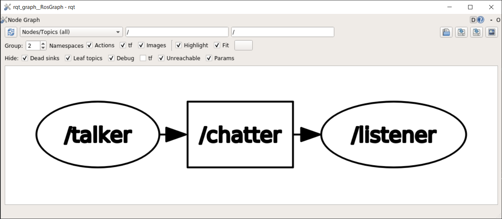
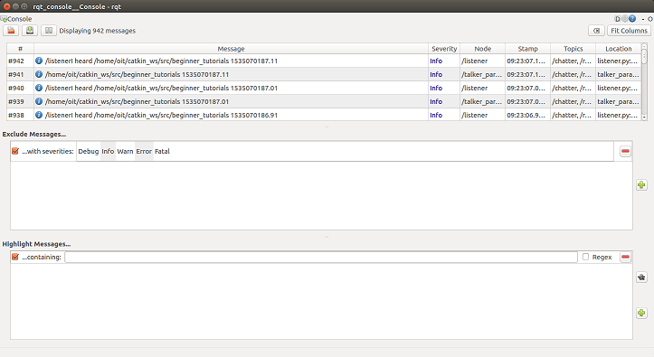

# roslaunch（ロスランチ）(Python)

[roslaunch（ロスランチ）](./roslaunch.md)

---

## 実習(3)

- 新たな`launch`ファイルを作成する。

```shell
$ roscd beginner_tutorials/launch
$ touch pair.launch # このファイルを編集する。
```

- `pair.launch`の内容は次の通り。

```xml
<launch>
  <node name="talker" type="talker.py" pkg="beginner_tutorials" />
  <node name="listener" type="listener.py" pkg="beginner_tutorials" />
</launch>
```

- 次のコマンドで`pair.launch`を実行しなさい。**これまでのように画面上に文字が流れることはない。**

```shell
$ roslaunch beginner_tutorials pair.launch
```

---

- 別の端末を開き`rqt_graph`を実行し、確かに 2 つのノードが起動していることを確認しなさい。



- 結果を確認したら、`Ctrl+C`で終了させなさい。
- `rostopic echo /chatter`コマンドを実行して`/chatter`トピックにデータが流れていることも確認しなさい。

```shell
data: "Good Bye 1535068294.95"
---
data: "Good Bye 1535068295.05"
---
```

- データが流れていることを確認したら、`Ctrl+C`で終了させなさい。

---

- `rqt_console`コマンドを実行し、トピックが流れていることを GUI でも確認しなさい。



- 最後に全ての端末を`Ctrl+C`で終了させ、端末を閉じなさい。

---

## 実習(4)

- `pair.launch`を編集し、`talker.py`を起動している`node`タグを次のように変更しなさい。
  - **param タグを追加するために node の終了タグが必要になったことに注意**

```xml
  <node name="talker" type="talker.py" pkg="beginner_tutorials" />
```

を

```xml
  <node name="talker" type="talker.py" pkg="beginner_tutorials">
    <param name="text" type="str" value="Hello ROS launch" />
  </node>
```

にする。

---

- `listener.py`を起動している`node`タグを次のように変更しなさい。

```xml
  <node name="listener" type="listener.py" pkg="beginner_tutorials" output="screen" />
```

- 次のコマンドで`pair.launch`を実行しなさい。

```shell
$ roslaunch beginner_tutorials pair.launch
# launch の起動メッセージが流れる。
[INFO] [1535068920.480185]: /listenerI heard Hello ROS launch 1535068920.48
[INFO] [1535068920.579530]: /listenerI heard Hello ROS launch 1535068920.58
[INFO] [1535068920.680067]: /listenerI heard Hello ROS launch 1535068920.68
```

- 動作が確認できたら`Ctrl+C`で終了させ、端末を閉じなさい。

---

- `talker.py`を起動している`node`タグを次のように変更しなさい。

```xml
  <node name="talker" type="talker.py" pkg="beginner_tutorials">
    <param name="text" type="str" value="$(find beginner_tutorials)" />
  </node>
```

- これまで同様`pair.launch`を実行しなさい。
- 実行結果

```shell
# launch の起動メッセージが流れる。
[INFO] [1535069164.599809]: /listenerI heard /home/「ユーザ名」/catkin_ws/src/beginner_tutorials 1535069164.6
[INFO] [1535069164.700438]: /listenerI heard /home/「ユーザ名」/catkin_ws/src/beginner_tutorials 1535069164.7
[INFO] [1535069164.799238]: /listenerI heard /home/「ユーザ名」/catkin_ws/src/beginner_tutorials 1535069164.8
```

---

[roslaunch（ロスランチ）](./roslaunch.md)
