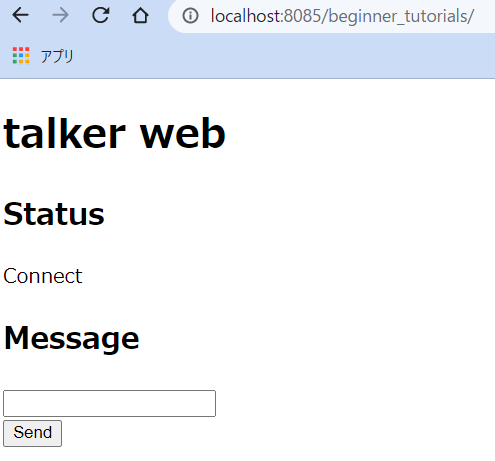

# WEB ブラウザからデータを送信する

実施前に以下を行っておくこと。

```shell
$ sudo apt update
$ sudo apt install ros-noetic-roswww -y
$ cd ~/setup_robot_programming/ros1
$ ./install_ros1_web.sh
# 実行結果
Start install ros-noetic web packages
[sudo] password for oit: # パスワード入力
Reading package lists... Done
・・・
[100%] Linking CXX executable /home/ubuntu/catkin_ws/devel/lib/robot_pose_publisher/robot_pose_publisher
[100%] Built target robot_pose_publisher #エラー無く 100% になればOK。
```

`ROS`は基本的には`Publisher/Subscriber`という手続きに沿って動くノード同士の通信しかサポートしていない。  
しかし、[rosbridge_server](http://wiki.ros.org/rosbridge_server)というシステムを使うことで、`TCP/IP`、`UDP`、`WebSocket`という他の通信方式を使い、`ROS`を使っていないプログラムとも通信することができる。

ここでは[rosbridge_server](http://wiki.ros.org/rosbridge_server)に加え、[roswww](http://wiki.ros.org/roswww)という WEB サーバを起動する`ROS`ノードを使い、 WEB ブラウザと`ROS`ノード間の通信について実験する。

1. 以下のディレクトリを作成しなさい。

```shell
$ roscd beginner_tutorials
$ pwd
/home/[user name]/catkin_ws/src/beginner_tutorials
$ mkdir launch www
```

2. [web_py.launch](./basics_01/web_py.launch)を`~/catkin_ws/src/beginner_tutorials/launch`にダウンロードしなさい。

```shell
$ roscd beginner_tutorials/launch
$ wget https://raw.githubusercontent.com/KMiyawaki/lecture_ros/main/basics_01/web_py.launch -O web_py.launch
```

3. [index.html](./basics_01/index.html)を`~/catkin_ws/src/beginner_tutorials/www`にダウンロードしなさい。

```shell
$ roscd beginner_tutorials/www
$ wget https://raw.githubusercontent.com/KMiyawaki/lecture_ros/main/basics_01/index.html -O index.html
```

4. ターミナルで起動している全てのソフトを終了してから下記コマンドを実行しなさい。

```shell
$ roslaunch beginner_tutorials web_py.launch
... logging to /home/[user name]/.ros/log/38823204-1f3e-11ec-a97a-80fa5b7fbe40/roslaunch-MyComputer-13226.log
Checking log directory for disk usage. This may take a while.

SUMMARY
========
...省略...
2021-09-27 11:54:28+0900 [-] WebSocketServerFactory starting on 9090
2021-09-27 11:54:28+0900 [-] Starting factory <autobahn.twisted.websocket.WebSocketServerFactory object at 0x7f73633f87d0>
2021-09-27 11:54:28+0900 [-] [INFO] [1632711268.107163]: Rosbridge WebSocket server started at ws://0.0.0.0:9090
```

5. WEBブラウザで[http://localhost:8085/beginner_tutorials/](http://localhost:8085/beginner_tutorials/)にアクセスしなさい。以下のような画面が見えるはずである。



6. ブラウザ上のテキストボックスに適当な文字を入れ、ボタンを押すと、`web_py.launch`を実行した端末上にブラウザから送信した文字が表示される。

7. 実験が終わったら、全てのターミナルのソフトとWEBブラウザの[http://localhost:8085/beginner_tutorials/](http://localhost:8085/beginner_tutorials/)を表示しているタブを閉じなさい。
