# ssh

[README](./README.md)

---

## `ssh`コマンド

- ネットワーク上の他のマシンにログインするコマンド。

```shell
ssh ユーザ名@ホスト名または接続先IPアドレス [-X]
```

- `-X`オプションは GUI のソフトを実行する際に必要。
  - サーバ側の設定によっては GUI のソフトが起動できない場合もある。

### `ssh`の必要性

- ロボットに搭載する CPU の形式は多様
  - 一般的なノートパソコン、とは限らない。
  - ディスプレイやキーボードの備わっていない、むき出しの基盤かもしれない。
- したがって、ディスプレイやキーボードを備えた操作用の PC をロボットに一台だけ搭載し、他の CPU にはネットワーク経由でログインして操作する必要がある。

## 実習(1)

- 大学のサーバにログインする。

```shell
$ ssh 「自分のアカウント名」@XXXXXXX # 接続先は教員から指示される。
# 初めて接続するときは次のような質問を受けるかもしれない。`yes`をタイプして次に進めればよい。
The authenticity of host 'remote_host_name (XXXXXXX)' can't be established.
RSA key fingerprint is XXXXXXXXXXXXX.
Are you sure you want to continue connecting (yes/no)?
自分のアカウント@XXXXXXX's password: # パスワードが聞かれるので入力し（画面には表示されない）Enter
Welcome to Ubuntu ...
Last login: Thu Feb  ...
[自分のアカウント@XXXX ~]%
```

- 実行後、パスワードを入力（画面には入力した文字は出ない）。
- `ls`や`cd`など、適当なコマンドを実行し、大学のサーバの自分のディレクトリにいることが分かったら次のコマンドで`ssh`を終了させる。

```shell
$ exit
logout
Connection to XXXXXXX closed.
```

---

## 補足

- 次のようなメッセージが出て接続できない場合がある。

```shell
@@@@@@@@@@@@@@@@@@@@@@@@@@@@@@@@@@@@@@@@@@@@@@@@@@@@@@@@@@@
@    WARNING: REMOTE HOST IDENTIFICATION HAS CHANGED!     @
@@@@@@@@@@@@@@@@@@@@@@@@@@@@@@@@@@@@@@@@@@@@@@@@@@@@@@@@@@@
IT IS POSSIBLE THAT SOMEONE IS DOING SOMETHING NASTY!
Someone could be eavesdropping on you right now (man-in-the-middle attack)!
It is also possible that the RSA host key has just been changed.
・・・
RSA host key for remote_host has changed and you have requested strict checking.
Host key verification failed.
```

- 接続先 PC が IP アドレスを変更した場合や IP アドレスが同じであっても異なる PC に接続する際に発生する。
- 最も簡単な対処方法は下記の通り。

```shell
$ rm ~/.ssh/known_hosts
```

- 次のページも参考になる。`.ssh/config` に設定を書いておくのもよい。
  - [SSH 接続エラー回避方法](https://qiita.com/grgrjnjn/items/8ca33b64ea0406e12938)
  - [OpenSSH の警告メッセージを出さないようにする方法](https://qiita.com/shotaTsuge/items/48bdaccdafa5475d9016)

## VSCodeで`ssh`する

`VSCode`でリモートマシンに`ssh`すると、自分の手元でプログラムを編集していたのと全く同じ感覚でファイルを編集できる。また、ドラッグ＆ドロップでファイルをコピーすることも簡単にできる。

- VSCodeに`Remote SSH`プラグインをインストールする。拡張機能で`ssh`と検索し、一番上のもので良い。

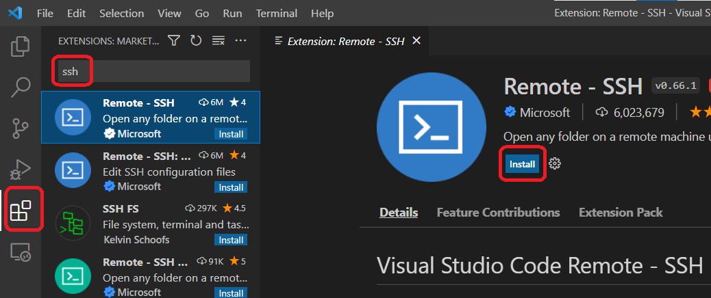

- ログイン先のIPアドレスを調べる。`ifconfig`コマンドを実行し、結果を確認する。下記の場合は`192.168.XXX.XXX`がIPアドレスである。

```shell
$ ifconfig
# 途中省略
wlan0: flags=4163<UP,BROADCAST,RUNNING,MULTICAST>  mtu 1500
        inet 192.168.XXX.XXX  netmask 255.255.255.0  broadcast 192.168.XXX.XXX
        
```

- リモートエクスプローラから`SSH Targets`を選択する。

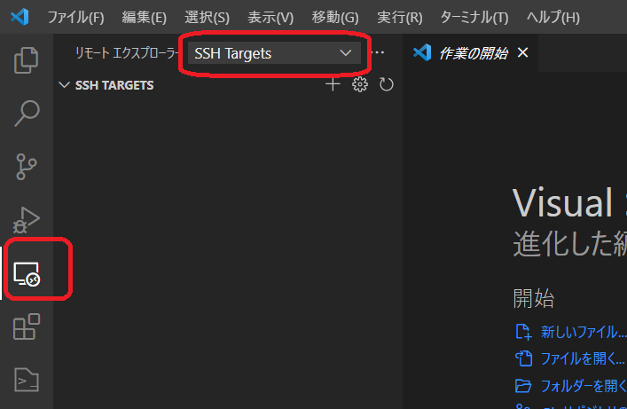

- `ssh`コマンドを入力する。このときのコマンドには先に調べたIPアドレスを使う。

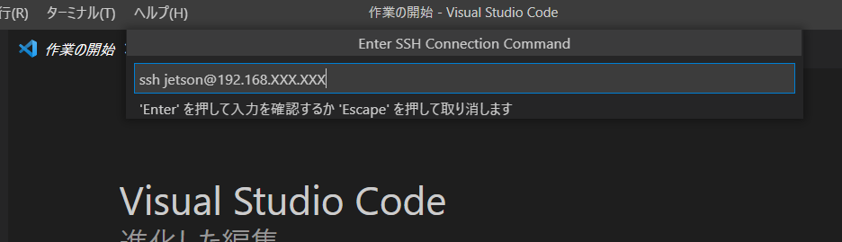

- `ssh`設定の保存先には`C:\Users\[ユーザ名]\.ssh\config`を使う。

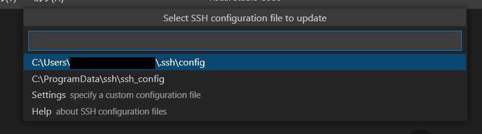

- 接続する。

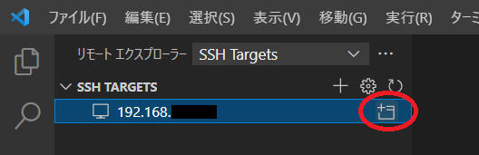

- `Linux`を選択する。

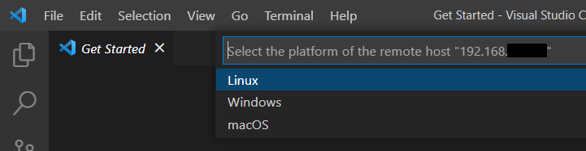

- 下のような画面が出た場合は`Continue`を選択する。

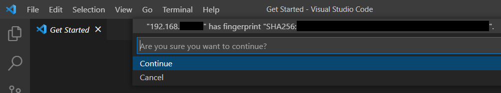

- 下のような画面が出た場合はパスワードを入力する。

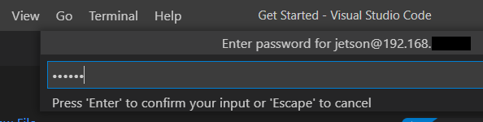

- フォルダを開く。日本語表示の場合もある。

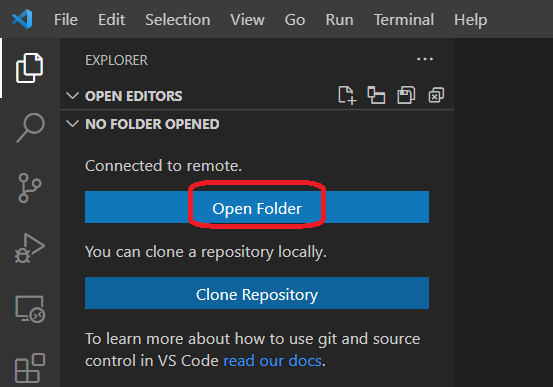

- `ROS`の`ワークスペース/src`を開く

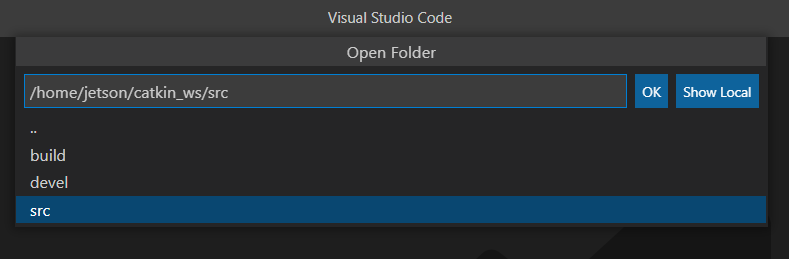

- パスワードを聞かれた場合は入力する。

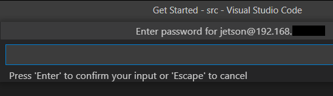

- 下記のようなダイアログが出た場合はチェックする。

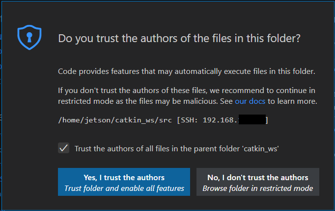

- `Ctrl+Shift+@`を押してターミナルを表示する。ここからコマンド入力もできる。
  - 画面下の方に今どのPCで作業をしているかが表示されている。プログラムの編集時は常に気を付けること。

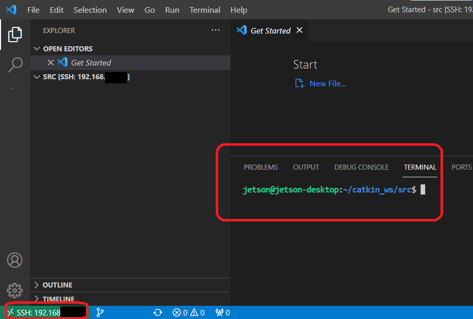

- 自分のパソコンで編集したファイルを`ssh`接続先にコピーするには、接続先のコピー先フォルダを開けてドラッグ＆ドロップすればよい。

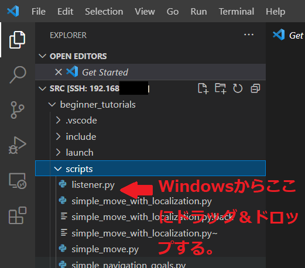

- `WSL`内のファイル編集に戻すにはリモートエクスプローラから`WSL Target`を選択し、インストール済み`Ubuntu`を選択する。

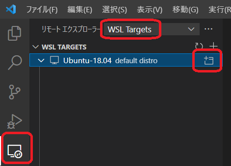

**`ssh`接続する際はどのPC（ロボットのCPU含む）にログインしているか、常に気にすること。**

そうでないと、思いがけず他人のファイルを編集してしまうこともある。

---

[README](./README.md)
