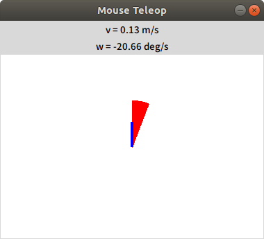

# Stage simulator

2 次元平面上を動くロボットのシミュレーション

[README](../README.md)

---

## PC を用意する

- ネイティブな Linux に ROS その他の必要なソフトを[インストール](https://github.com/KMiyawaki/setup_robot_programming)する。
- [シミュレータ](https://github.com/KMiyawaki/oit_navigation_minibot_light_01)もインストールしておくこと。
- 仮想環境（Docker、WSL、Virtual Box）でも実行可能。

## 実習で使うシミュレータのインストール

インストールされているか確認する。

```shell
$ cd ~/catkin_ws/src/
$ ls|grep oit_smartbot_diff_02
oit_smartbot_diff_02 # この表示があればインストール済み。
```

なければ別途インストール方法を指示するので従うこと。

## [Stage](http://wiki.ros.org/stage)のサンプルを実行する

- ターミナルを全て閉じて開き直し、以下のコマンドを実行。

```shell
$ roslaunch oit_smartbot_diff_02 stage_navigation.launch
# もしも、独自に作成したシミュレーションのマップを使いたい場合は次のオプションをつける。
# $ roslaunch oit_smartbot_diff_02 stage_navigation.launch map_name:=your_own_map
... logging to /home/[user name]/.ros/log/ebe20526-4944-11ea-a3d0-000c2924787d/roslaunch-ubuntu-16196.log
Checking log directory for disk usage. This may take awhile.
Press Ctrl-C to interrupt
Done checking log file disk usage. Usage is <1GB.

xacro: in-order processing became default in ROS Melodic. You can drop the option.
started roslaunch server http://ubuntu:34745/

SUMMARY
========
...
# メッセージが流れていくつか GUI のウィンドウが開く。
```

### 画面の説明

- `Stage`が生成したシミュレーションの世界


- `RViz`（**重要**）
  - `ROS`のシステムで頻繁に使用する可視化ソフト。
  - 今回のサンプルではあらかじめ取得されている地図上にロボットが置かれている様子が表示されている。


## ロボットのナビゲーション

- ロボット用語としてのナビゲーションは、任意の位置にロボットを自律移動させることを指す。次の 2 つのステップから成る。

1. 自己位置推定
2. 障害物回避しながら目標位置への移動

- これらの機能は ROS では Navigation メタパッケージによって実現できる。
  - 実機でもシミュレーションでも使えるし、必要。
  - 参考 [ROS の navigation のページ](http://wiki.ros.org/navigation)

### 自己位置推定

- あらかじめ取得された地図の形と、ロボット搭載の LRF から得られたデータを比較することでロボットが現在地図上のどこにいるかを推定する。
- `RViz`上でLRFのデータが壁の形と全く一致していない場合、つまり、ロボットが自分が地図の中でどこにいるか見失っているときに使う。
- `RViz`上で`2D Pose Estimate`ボタンをクリックし、地図上のロボットがいるであろう場所から向いている方向に向かって左ドラッグして離す。


- 下図のように LRF のデータ（黄色い点で示されている）が地図の壁とおおよそ一致すれば OK 。


- **注意**
  - いくつかのシミュレーションではもともとロボットの自己位置推定が完了した状態で始まるものもあり、その場合は推定の効果が分かりにくいかもしれない。
  - しかし、実際のロボットは電源投入時に地図のどこに置かれたかはわからないため、自己位置推定は必須である。

### ナビゲーションゴールの指定

- `RViz`上で`2D Nav Goal`ボタンをクリックし、ゴール地点でロボットを向かせたい方向に向けて左ドラッグして離す。


このとき`[ WARN] [1632265888.031145400, 502.600000000]: Off Map 6.105112, 4.825516`のような警告が出ることがあるが無視して良い。

- 経路が計算され、ナビゲーションが始まる。ゴールに到着し、指定された方向を向くと終了する。
- 経路によってはなかなかゴールに到着せず、回転が続くこともある。


## テレオペレーション

ロボットをマウスやキーボード、場合によってはジョイスティックで動作させる。シミュレータを起動したまま以下のコマンドを実行しなさい。

### マウステレオペ

```shell
$ rosrun  mouse_teleop mouse_teleop.py mouse_vel:=cmd_vel
```

以下のようなマウステレオペウィンドウが開く。



Mouse Teleop ウィンドウ上でマウスをドラッグすると前進・旋回速度をロボットに与えられる。

- Mouse Teleop はウィンドウの「☓」マークをクリックしないと終了できないので、注意。

### キーボードテレオペ

```shell
$ rosrun key_teleop key_teleop.py key_vel:=cmd_vel
```

コマンドを実行したターミナルの表示が以下のようになる。このターミナルで上下左右の矢印キーを押すとロボットが動く。

```text
  Linear: 0.000000, Angular: 0.000000


  Use arrow keys to move, q to exit.
```

## 参考文献

- [How to Use Player/Stage](http://player-stage-manual.readthedocs.io/en/stable/)

<!--
## 参考資料

- [実機で作成した地図をシミュレーションで使う](./stage_simulator_and_ros_use_custom_map.md)
- [Stage Simulator (Advanced 1)](./stage_simulator_advanced_01.md)
- [Stage Simulator (Advanced 2)](./stage_simulator_advanced_02.md)
- [Stage Simulator (Advanced 3)](./stage_simulator_advanced_03.md)
- [Stage Simulator (Advanced 4)](./stage_simulator_advanced_04.md)
-->

---

[README](../README.md)
